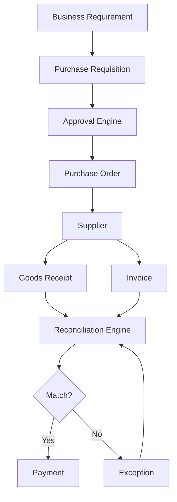

# 🧪 SAP Ariba P2P Simulator

A Python-based simulation of an end-to-end **Procure-to-Pay (P2P)** process inspired by common SAP Ariba procurement workflows.

This lab is designed to demonstrate how a procurement transaction moves from a business requirement through purchase requisition, approval, purchase order, goods receipt, invoice reconciliation, and payment.

> **Important:** This is an educational simulation. It does not connect to a real SAP Ariba tenant, SAP Business Network, SAP ERP, or production system.

---

## 🎯 Objective

The purpose of this simulator is to convert SAP Ariba P2P concepts into executable Python logic.

Instead of only documenting:

```text
Purchase Requisition
        ↓
Purchase Order
        ↓
Goods Receipt
        ↓
Invoice
        ↓
Payment
```

the simulator models these stages using Python objects, validation rules, transaction data, and reconciliation logic.

---

# 🔄 P2P Flow

```text
Business Requirement
        ↓
Purchase Requisition
        ↓
Approval
        ↓
Purchase Order
        ↓
Supplier
        ↓
Goods Receipt
        ↓
Supplier Invoice
        ↓
Invoice Reconciliation
        ↓
Payment
```

---

# 🏗️ Planned Architecture



---

# 📁 Project Structure

The simulator will be developed incrementally.

```text
p2p-simulator/
│
├── README.md
├── main.py
│
├── models/
│   ├── __init__.py
│   ├── supplier.py
│   ├── purchase_requisition.py
│   ├── purchase_order.py
│   ├── goods_receipt.py
│   └── invoice.py
│
├── services/
│   ├── __init__.py
│   ├── approval.py
│   ├── reconciliation.py
│   └── payment.py
│
├── data/
│   └── sample_data.json
│
├── tests/
│   ├── test_purchase_order.py
│   ├── test_reconciliation.py
│   └── test_payment.py
│
└── requirements.txt
```

---

# 🧩 Components

## 1. Purchase Requisition

Represents an internal request to purchase goods or services.

Example:

```json
{
    "requester": "Prateek",
    "material": "Laptop",
    "quantity": 5,
    "unit_price": 75000
}
```

---

## 2. Approval Engine

The simulator will apply simplified approval rules.

Example:

```text
Amount < ₹50,000
        ↓
Automatic approval

Amount ≥ ₹50,000
        ↓
Manager approval
```

The actual approval rules in a real SAP Ariba implementation depend on the organization's configuration.

---

## 3. Purchase Order

After approval, a purchase order is generated.

Example:

```json
{
    "po_number": "PO10001",
    "supplier": "Demo Supplier",
    "quantity": 5,
    "unit_price": 75000,
    "total": 375000
}
```

---

## 4. Goods Receipt

The simulator records how much of the ordered quantity was received.

Example:

```text
PO Quantity      = 100
Received Quantity = 95
```

This creates a potential reconciliation exception if the supplier invoices all 100 units.

---

## 5. Invoice

The supplier submits an invoice.

Example:

```json
{
    "invoice_number": "INV10001",
    "po_number": "PO10001",
    "quantity": 100,
    "unit_price": 75000
}
```

---

# 🔍 Invoice Reconciliation

The simulator will compare:

```text
Purchase Order
      +
Goods Receipt
      +
Invoice
```

Conceptually:

```text
             PO
             │
             │
        ┌────┴────┐
        │         │
        ▼         ▼
      Receipt   Invoice
        │         │
        └────┬────┘
             ▼
       Reconciliation
             │
       ┌─────┴─────┐
       │           │
      Match      Mismatch
       │           │
       ▼           ▼
    Payment     Exception
```

---

# 🚨 Example Exception

Suppose:

```text
PO quantity       = 100
Goods received    = 95
Invoice quantity  = 100
```

The simulator should identify:

```text
STATUS: EXCEPTION

Reason:
Invoice quantity exceeds received quantity.

PO Quantity: 100
Received: 95
Invoiced: 100
Difference: 5
```

This demonstrates how transaction data can be analyzed to identify procurement exceptions.

---

# 💳 Payment

Payment should only become eligible after the reconciliation process succeeds according to the simulator's configured rules.

Example:

```text
Invoice
   ↓
Reconciliation
   ↓
PASS
   ↓
Payment Eligible
```

If reconciliation fails:

```text
Invoice
   ↓
Reconciliation
   ↓
FAIL
   ↓
Exception
   ↓
Resolution
   ↓
Reconciliation
```

---

# 🧠 SAP Concepts Demonstrated

This simulator is intended to reinforce:

* Procure-to-Pay
* Purchase requisition
* Approval workflow
* Purchase order
* Supplier
* Goods receipt
* Invoice
* Invoice reconciliation
* Quantity matching
* Exception handling
* Payment eligibility
* Transaction lifecycle
* Master vs transaction data concepts

---

# 🐍 Python Concepts Demonstrated

The implementation will also demonstrate:

* Classes
* Objects
* Functions
* Modules
* JSON
* Lists and dictionaries
* Validation
* Exception handling
* File handling
* Object-oriented programming
* Unit testing
* Basic application architecture

---

# 🧪 Testing Scenarios

The simulator will eventually contain tests for:

### Scenario 1 — Successful P2P

```text
PO = 100
GR = 100
Invoice = 100

Expected:
PASS
```

### Scenario 2 — Partial Receipt

```text
PO = 100
GR = 95
Invoice = 100

Expected:
EXCEPTION
```

### Scenario 3 — Invoice Under PO

```text
PO = 100
GR = 100
Invoice = 95

Expected:
PASS / configured tolerance handling
```

### Scenario 4 — Invalid PO

```text
Invoice references:
PO99999

Expected:
ERROR
```

### Scenario 5 — Price mismatch

```text
PO Price       = ₹1,000
Invoice Price  = ₹1,200

Expected:
PRICE EXCEPTION
```

---

# 🚀 Future Enhancements

The simulator can eventually be expanded with:

* Supplier master data
* Material master data
* Company codes
* Plants
* Purchasing organizations
* Purchasing groups
* Currency
* Tax
* Multiple PO items
* Approval hierarchy
* Tolerance configuration
* Partial deliveries
* Partial invoices
* Credit memos
* Service purchase orders
* Reporting
* SQLite/PostgreSQL database
* REST API
* FastAPI backend
* Web dashboard
* Docker
* Automated testing
* GitHub Actions

---

# 🎓 Learning Goal

This project is intentionally designed to bridge the gap between:

```text
SAP Ariba Theory
       ↓
Business Process
       ↓
Transaction Data
       ↓
Programming Logic
       ↓
Validation
       ↓
Exception Handling
       ↓
Integration Concepts
```

The goal is not to recreate SAP Ariba.

The goal is to **model the business logic behind an Ariba-style procurement process using software engineering concepts.**

---

## ⚠️ Disclaimer

This project is an independent educational simulation and learning purpose.

It is not affiliated with, sponsored by, or endorsed by SAP SE.

All suppliers, companies, transaction numbers, prices, and examples used in this simulator are fictional or sanitized.

---

## 👨‍💻 Author

**Prateek**

GitHub: [@Ram-2200](https://github.com/Ram-2200)
